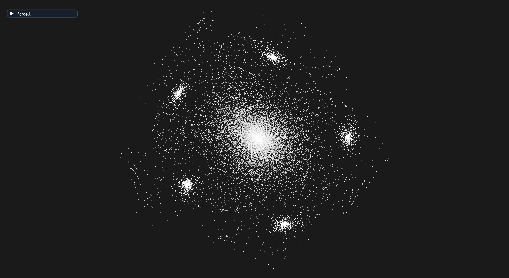

# Dotter
Simple strange attractors visualizer on C++.

Version: 1.0.0 (17.07.2024)

Inspired by [complexity-explorables](https://complexity-explorables.org).

## ✨ Features
+ 4 strange attractors
+ Supporting Ubuntu and Windows
+ Fullscreen mode
+ Style customizing

## 📸 Screenshots


## 💿 Pre-compiled Binaries
(Only for x64 processors)
You can download pre-compiled binaries in [releases](https://github.com/Megospc/Dotter/releases).

## ▶️ How To Build
### 🔧 What You Need
For Windows:
+ MinGW-w64
+ CMake
+ GNU Make

For Ubuntu, these packages:
+ gcc
+ cmake
+ make

### 📄 Steps
1. Download zip-archive with source code.
2. Extract the archive.
3. (Only for windows) Open `run.bat` in Notepad and edit compiler and make paths if needed.
4. Open folder with `CMakeLists.txt` in terminal.
5. Enter these commands:
```Bash
# Ubuntu
bash ./run.sh

# Windows
./run.bat
```
6. Wait for compilation to complete.
7. The Dotter's window should open.
8. Then you can open `Dotter.exe` (`Dotter` for Ubuntu) to run it again.

## ⚙️ System Requirements
+ OpenGL 3.3 compatible GPU

## 😃 Dependicies
There are these libraries used in this project:
+ [Dear ImGui](https://github.com/ocornut/imgui)
+ [GLFW 3.4](https://github.com/glfw/glfw)
+ [GLAD](https://github.com/dav1dde/glad-web)
+ [STB](https://github.com/nothings/stb)
+ [vecpp](https://github.com/Megospc/vecpp)